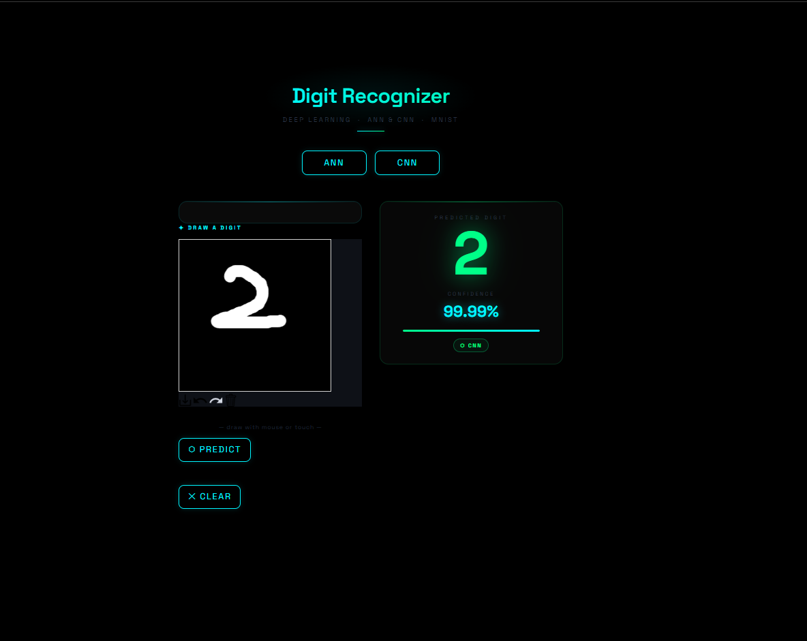

# 🧠 Digit Recognizer AI

> **Live App** → [digitai-deep-learning-4phwxyqud2siuisns3glkj.streamlit.app](https://digitai-deep-learning-4phwxyqud2siuisns3glkj.streamlit.app)

A deep learning web app that recognizes handwritten digits in real time — built with **Streamlit** and trained on the **MNIST** dataset using ANN and CNN models.


---

## 🖼️ Preview



---

## ✨ Features

- ✏️ **Draw a digit** on an interactive canvas using your mouse or touch
- 🤖 **Switch between two models** — ANN and CNN — with a neon toggle bar
- 🎯 **Instant prediction** with digit display and confidence percentage
- 🌑 **Dark mode UI** — pure black background with neon cyan/green accents
- ⚡ **MNIST-faithful preprocessing** — tight crop, centering, and normalization

---

## 🗂️ Project Structure

```
digit-recognizer/
│
├── app.py                  # Main Streamlit application
├── ann_model.onnx          # Trained ANN model (~97% accuracy)
├── cnn_model.onnx          # Trained CNN model (~99% accuracy)
├── digit_recognition.ipynb # Training + ONNX export notebook
├── digit.png               # App screenshot
├── requirements.txt        # Python dependencies
└── README.md
```

---

## 🧬 Models

| Model | Architecture | Parameters | Test Accuracy |
|-------|-------------|------------|---------------|
| **ANN** | Flatten → Dense(128) → Dense(64) → Dense(10) | ~109K | ~97% |
| **CNN** | Conv2D(32) → Pool → Conv2D(64) → Pool → Dense(128) → Dense(10) | ~203K | ~99% |

Both models trained on the MNIST dataset (60,000 training images, 10,000 test images) and exported to **ONNX format** for universal deployment.

---

## 🚀 Run Locally

**1. Clone the repo**
```bash
git clone https://github.com/your-username/digit-recognizer.git
cd digit-recognizer
```

**2. Create a virtual environment (recommended)**
```bash
python -m venv venv
source venv/bin/activate        # Mac/Linux
venv\Scripts\activate           # Windows
```

**3. Install dependencies**
```bash
pip install -r requirements.txt
```

**4. Run the app**
```bash
streamlit run app.py
```

Opens at `http://localhost:8501` 🎉

---

## ☁️ Deploy on Streamlit Cloud

1. Push this repo to GitHub (make sure `.onnx` model files are included)
2. Go to [share.streamlit.io](https://share.streamlit.io)
3. Click **New app** → select your repo
4. Set **Main file path** to `app.py`
5. Click **Deploy** ✅

> Deploys in ~30 seconds — no TensorFlow, no Python version issues.

---

## 📦 Requirements

```
streamlit>=1.32.0
onnxruntime>=1.17.0
numpy>=1.24.0
Pillow>=10.0.0
plotly>=5.0.0
streamlit-drawable-canvas==0.9.3
```

---

## 🔧 How the Preprocessing Works

Raw canvas drawings go through an MNIST-faithful pipeline before prediction:

```
RGBA canvas (280×280)
  │
  ├─ Extract RGB brightness (ignore alpha — always 255)
  ├─ Threshold > 30 to isolate stroke pixels
  ├─ Tight bounding box crop
  ├─ Pad to square
  ├─ Add 20% border padding (MNIST-style centering)
  ├─ Resize to 28×28 with LANCZOS
  └─ Normalize to [0, 1]
```

---

## 🔄 Re-training & ONNX Export

To retrain or re-export the models, open `digit_recognition.ipynb` in Google Colab and run all cells. The last cell automatically:
- Installs `tf2onnx`
- Converts both models to `.onnx`
- Downloads them to your machine

---

## 📄 License

This project is open source under the [MIT License](LICENSE).

---

<div align="center">
  Made with ❤️ using Streamlit & ONNX Runtime
</div>
